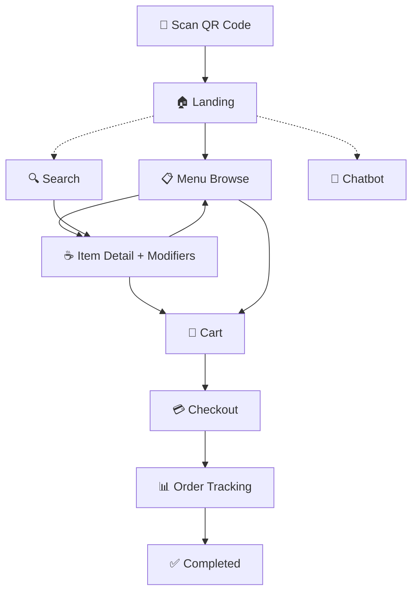

# ☕ Kopi Nusantara — Customer-Side Cafe Ordering App

Aplikasi pemesanan sisi pelanggan berbasis **PWA (Progressive Web App)** untuk kafe. Pelanggan cukup **scan QR Code** di meja, langsung pesan dari browser — tanpa download, tanpa login.

---

## 🚀 Quick Start

1. Buka file `index.html` langsung di browser, atau
2. Gunakan **Live Server** extension di VS Code
3. Akses via `http://localhost:5500/index.html?table=05`

> Parameter `?table=05` menentukan nomor meja (otomatis dari QR Code).

---

## 📋 Tech Stack

| Layer | Teknologi |
|-------|-----------|
| Structure | **HTML5** |
| Styling | **CSS3** + **Bootstrap 5** (CDN) |
| Logic | **JavaScript (ES6+)** — Vanilla, tanpa framework |
| Icons | **Bootstrap Icons** (CDN) |
| Font | **Google Fonts — Plus Jakarta Sans** |
| Animasi | **CSS Transitions + Keyframes** |

> **Tanpa build tool** — tidak perlu npm, Vite, atau bundler. Cukup buka `index.html`.

---

## 📱 App Flow

```
Scan QR → Landing → Menu Browse → Item Detail (Modifier) → Cart → Checkout → Order Tracking → Selesai
```



---

## 🎨 Design System

### Color Palette (Dark Coffee Theme)

| Token | Hex | Kegunaan |
|-------|-----|----------|
| `--color-bg-primary` | `#0D0D0D` | Latar utama |
| `--color-bg-secondary` | `#1A1612` | Card / surface |
| `--color-bg-tertiary` | `#2A2320` | Elevated surface |
| `--color-accent` | `#C8956C` | CTA, accent (warm caramel) |
| `--color-text-primary` | `#F5F0EB` | Teks utama |
| `--color-text-secondary` | `#9E918A` | Teks muted |
| `--color-success` | `#5CB85C` | Status berhasil |
| `--color-warning` | `#E8A838` | Promo / badge |
| `--color-danger` | `#D9534F` | Sold out / error |

### Typography

- **Font:** Plus Jakarta Sans (400, 500, 600, 700)
- **Scale:** 11px (caption) → 28px (heading XL)

---

## 📄 Halaman

### 1. Landing (`#page-landing`)
- Auto-detect nomor meja dari URL
- Logo + branding kafe
- Tombol "Lihat Menu" dengan pulse animation
- **Tidak ada login wall**

### 2. Menu Browse (`#page-menu`)
- 🔍 Search bar dengan live filter (debounce 300ms)
- 🏷️ Promo banner carousel
- Category pills (horizontal scroll, sticky)
- Menu grid 2 kolom dengan foto dominan
- Badges: 🔥 Best Seller, 🌱 Vegan, 🌶️ Spicy
- Sold out = greyed-out + label "Habis"
- 🛒 Cart FAB (muncul setelah ≥1 item)

### 3. Item Detail (Bottom Sheet)
- Hero image full-width
- **Advanced Modifier System:**
  - `required_one` → Radio, wajib dipilih (tombol disabled jika belum)
  - `optional_one` → Radio, opsional
  - `optional_many` → Checkbox, bisa pilih banyak
- Harga dinamis: `Total = (base + Σ modifiers) × qty`
- Catatan khusus (textarea)
- Quantity selector (−/+)

### 4. Cart (`#page-cart`)
- Daftar item dengan ringkasan modifier
- Edit (buka kembali modifier sheet) & Hapus
- 🔥 Upsell section (item yang belum di cart)
- Subtotal + Pajak (10%) + Total
- State kosong dengan ilustrasi

### 5. Checkout (`#page-checkout`)
- 📍 Nomor meja (auto, tidak bisa diubah)
- 🎫 Punya Member? (opsional, Ya/Tidak)
  - Jika "Ya" → muncul input 📞 No. Handphone
- 📝 Ringkasan pesanan + harga
- 💳 Metode pembayaran: QRIS/E-Wallet atau Bayar di Kasir

### 6. Order Tracking (`#page-tracking`)
- Progress bar 3 tahap: Diterima → Dibuat → Siap
- Animasi kopi (CSS steam animation)
- Simulasi auto-advance setiap 5 detik
- Tombol "Selesai" (aktif saat pesanan siap)

### 🤖 Chatbot (Bottom Sheet)
- FAB di kiri bawah (semua halaman kecuali landing)
- Quick replies: Rekomendasi, Promo, Non-Kafein, Alergen
- Keyword matching: WiFi, toilet, jam buka, parkir, dll.
- Rule-based (integrasi AI di fase berikutnya)

---

## 📁 Struktur File

```
Dashboard Cafe/
├── index.html                  # SPA — semua page sections
├── manifest.json               # PWA manifest
├── README.md
│
├── css/
│   ├── variables.css           # Design tokens
│   ├── style.css               # Custom styles + Bootstrap override
│   └── animations.css          # Keyframe animations
│
├── js/
│   ├── app.js                  # Router, init, FAB management
│   ├── data.js                 # Mock menu data (16 items, 4 kategori)
│   ├── store.js                # State management (cart, order)
│   ├── menu.js                 # Menu page: grid, filter, search
│   ├── item-detail.js          # Bottom sheet: modifiers, harga dinamis
│   ├── cart.js                 # Cart: render, edit, hapus, upsell
│   ├── checkout.js             # Checkout: member, payment, confirm
│   ├── tracking.js             # Order tracking: progress simulation
│   ├── chatbot.js              # Chatbot: quick replies, keyword match
│   └── utils.js                # formatRupiah, toast, debounce
│
└── images/                     # Menu photos
```

---

## 🔧 Navigasi (Section Toggle)

Semua halaman ada di satu `index.html`, ditampilkan/disembunyikan via JavaScript:

```javascript
navigateTo('page-menu');  // Buka halaman menu
navigateTo('page-cart');  // Buka keranjang
```

| Section ID | Halaman |
|------------|---------|
| `#page-landing` | Landing / Splash |
| `#page-menu` | Menu Browse |
| `#page-cart` | Keranjang |
| `#page-checkout` | Checkout |
| `#page-tracking` | Order Tracking |

---

## 📊 Struktur Data Menu

Setiap item menu mengikuti format:

```json
{
  "id": "menu_kopi_01",
  "name": "Caramel Macchiato",
  "category": "signature",
  "base_price": 35000,
  "description": "Espresso lembut dengan saus karamel...",
  "image": "images/caramel_macchiato.jpg",
  "tags": ["best-seller"],
  "available": true,
  "modifiers": [
    {
      "group_name": "Temperature",
      "type": "required_one",
      "options": [
        { "name": "Hot", "price": 0 },
        { "name": "Ice", "price": 0 }
      ]
    },
    {
      "group_name": "Milk Option",
      "type": "optional_one",
      "options": [
        { "name": "Regular Milk", "price": 0 },
        { "name": "Oat Milk", "price": 8000 }
      ]
    }
  ]
}
```

**Tipe Modifier:**
| Tipe | Input | Validasi |
|------|-------|----------|
| `required_one` | Radio | Wajib pilih, tombol disabled jika belum |
| `optional_one` | Radio | Opsional |
| `optional_many` | Checkbox | Bisa pilih 0 hingga semua |

---

## 📱 Responsive

| Viewport | Layout |
|----------|--------|
| < 480px | 2 kolom grid menu |
| 480px – 768px | 3 kolom grid menu |
| > 768px | Max-width 480px centered |

> Target utama: **mobile-first** (360px–428px) karena diakses via QR Code di meja.

---

## ✅ UX Guidelines

- **No Login Wall** — Pelanggan langsung pesan sebagai guest
- **Clear Error State** — Sold out item di-grey-out, tidak bisa diklik
- **Visual-first** — Foto menu dominan, badge informatif
- **Dynamic Pricing** — Harga update real-time saat modifier dipilih
- **Zero Friction** — Scan QR → pesan → bayar dalam hitungan detik
